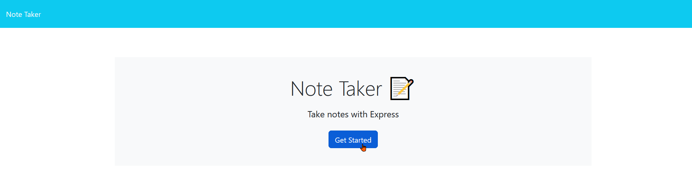
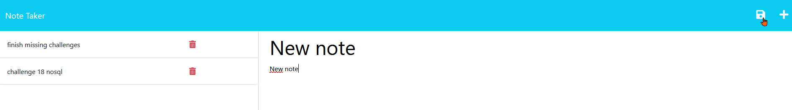
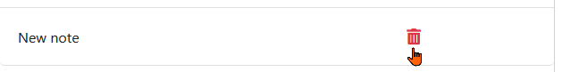

# <Your-Project-Title>

## Description

This is an application that helps you save notes and make a list of saved noted for you to see as you create or delete them.

## Table of Contents (Optional)

If your README is long, add a table of contents to make it easy for users to find what they need.

- [Installation](#installation)
- [Usage](#usage)
- [Credits](#credits)
- [Link](#link)

## Installation

N/A

## Usage

As soon as you load the application you are presented with the next screen, click the `Get Started` button in order to access your notes:

When you enter the note taking section you will be presented with a navbar and 2 columns below the navbar, the left column presents the saved notes in the application, while the colum on the right allows you to read said notes by clicking them, or by clicking the `+` symbol on the top right of the page you can add a new note:

Finally in order to save a new note first you need to write both a title and the content of the new note, after this a save icon will be shown to the left of the `+` symbol on the top right of the page, like in the picture below:

In case you want to delete a note, to the right of every note there is a "Delete icon" which you can press and the note will be deleted

## Credits

This application´s functionality was done by me, with starter code provided by the bootcamp, also the uuid code was obtained from stackoverflow:
https://stackoverflow.com/questions/38890434/how-to-get-purely-unique-number-in-javascript

## Link

Link to deployed application:

https://note-taker-hevm-ecd9defb7fec.herokuapp.com/
